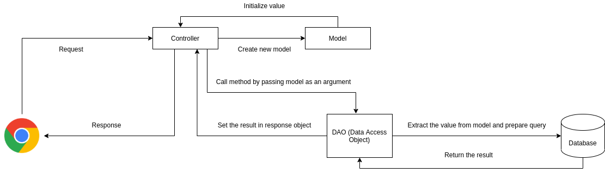

## Servlet MVC
MVC pattern stands for Model-View-Controller. It is used to seperate application's concern.

* Model : Model represents an object or Java POJO carrying data. It can also have to update controller if its data changes.
* View : View represents the visualization of the data that model consists.
* Controller : Controller acts on both model and view. It controls the data flow into model object and updates the view whenever data changes. It keeps view and model seperate.



### Prerequisite
* Java 8 or higher
* Apache Tomcat 7.0 or higher [Download Here](https://tomcat.apache.org/download-70.cgi)
* Apache Netbeans / Netbeans / Intellij Idea
* MySQL Server [Download Here](https://filehippo.com/download_mysql/)
* MySQL Workbench [Download Here](https://dev.mysql.com/downloads/file/?id=497505)


### Running the project
* Clone the repository

  ``git clone https://github.com/nischalshakya30/ServletDemos.git``

* Open the IDE

* Create the **servlet-demos database**.

* Execute the below sql query. 

  ```sql
  CREATE TABLE `student` (
  `id` int(11) NOT NULL AUTO_INCREMENT,
  `first_name` varchar(45) DEFAULT NULL,
  `last_name` varchar(45) DEFAULT NULL,
  `address` varchar(45) DEFAULT NULL,
  `phone_number` bigint(20) DEFAULT NULL,
  PRIMARY KEY (`id`)
  ) ENGINE=InnoDB AUTO_INCREMENT=10 DEFAULT CHARSET=latin1;
  ```

* Go the File / Open the project

* Setup up the apache tomcat server

* Run the project 


